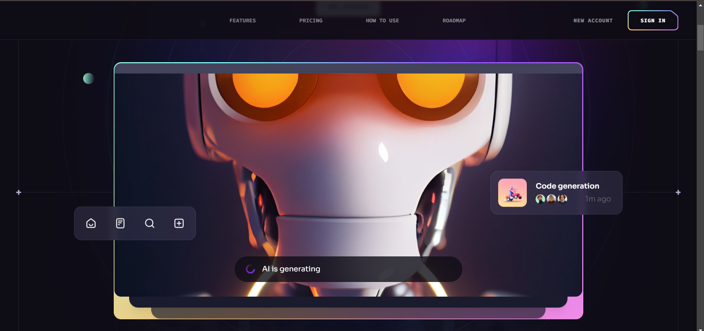
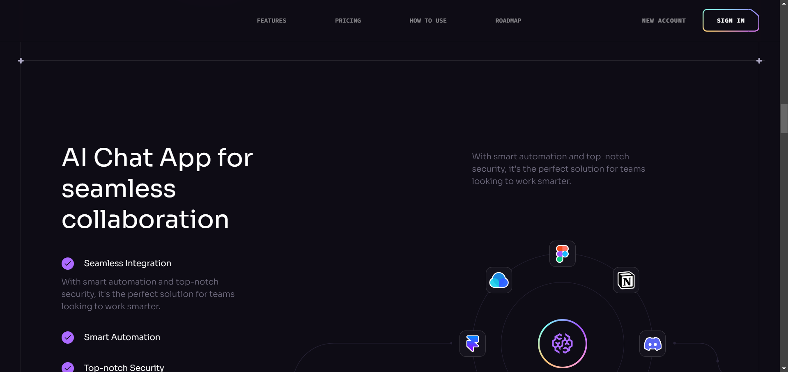
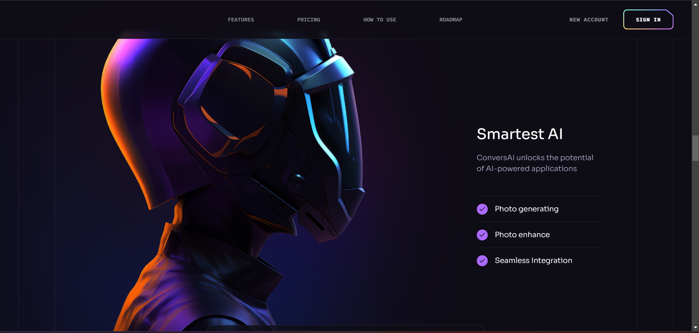
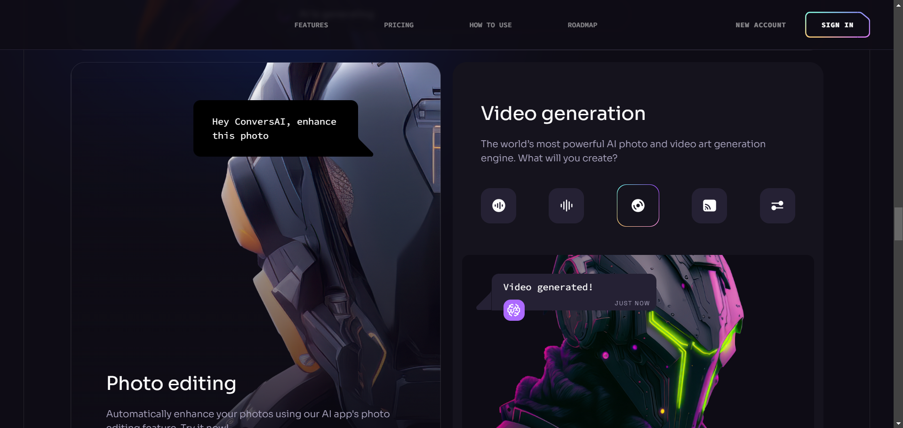
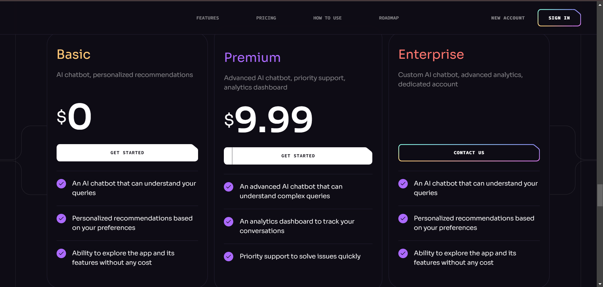
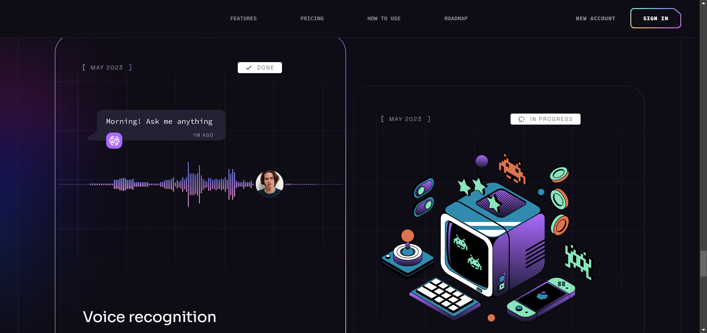
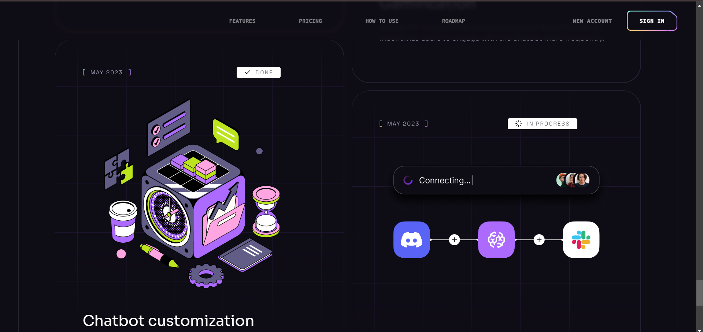
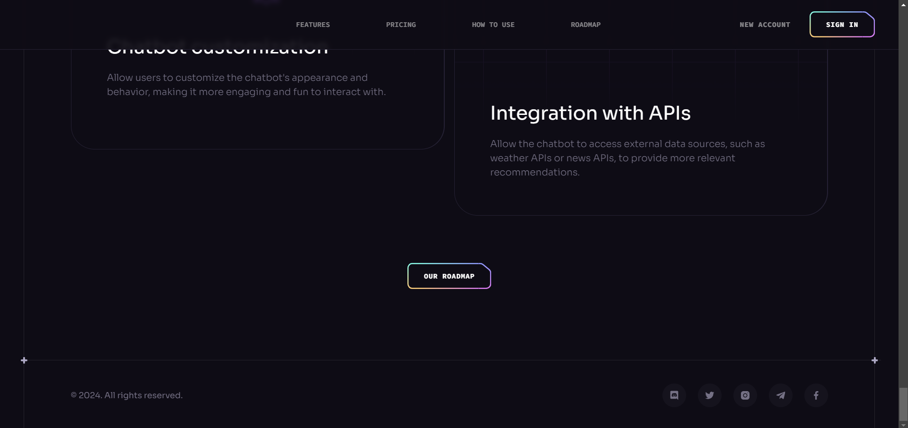

# ConversAI

ConversAI is a showcase of modern UI/UX design principles, developed using React.js and Tailwind CSS. This project highlights sleek design, seamless animations, and an overall user experience that sets a high standard for future modern applications and websites.

# 🚀 Project Overview
ConversAI serves as an inspirational example of contemporary design. It features:

### Beautiful Sections: 
Includes hero, services, features, how to use, roadmap, pricing, footer, and header.
### Parallax Animations:
Engaging effects triggered by mouse movement and scrolling.
### Complex UI Geometry: 
Uses Tailwind CSS for intricate shapes such as circular feature displays, grid lines, and side lines.
### Latest UI Trends: 
Incorporates modern design elements like bento grids.
### Cool Gradients: 
Enhances visuals with stylish gradients using Tailwind CSS for cards, buttons, and more.
### Responsive Design: 
Ensures seamless functionality and aesthetics across all devices.


## Note: This project is a demonstration of design and does not include functional features beyond the visual presentation.

# 🛠 Technologies Used
-Vite: For fast and optimized build processes.
-React.js: For creating dynamic and interactive user interfaces.
-Tailwind CSS: For modern and customizable styling.


## 📋 Getting Started
To view the project locally on your machine, follow these steps:

Prerequisites
Make sure you have the following installed:

- [Git](https://git-scm.com/)
- [Node.js](https://nodejs.org/en)
- [npm](https://www.npmjs.com/) (Node Package Manager)


## Installation

Install the project dependencies using npm:

```bash
npm install
```

**Running the Project**

```bash
npm run dev
```
```
 Open [http://localhost:5173](http://localhost:5173) in your browser to view the project.

```


## A Glance at the Website


 

  

  

  

  

  

  

  

  

 


 


 
